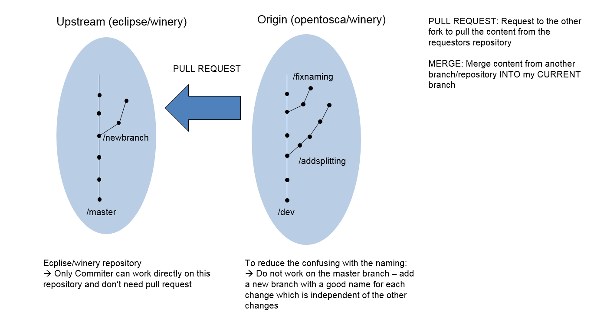

# Winery Toolchain

---
## IntelliJ

* Install Plugins
  1. JRebel
    - JRebel enables a better debugging - changes can be immediately loaded without building the whole project again
    - Download https://zeroturnaround.com/software/jrebel/
    - File --> Settings --> Plugins --> Search for JRebel
    - If JRebel is not available press "Browse repositories" --> Search -->Install
  2. Checkstyle
    - httpa://eclipse.github.io/winery/ --> IntelliJ Ultimate Setup
    - Follow the steps and apply it in IntelliJ
* Shortcuts
  - 2x Shift / Str + Shift + F / Str + F: Differrent forms of search
  - Str + Alt + O: check style
  - Str + X: if nothing is marked - delete line and free space
  
---

## Git

Scroll down for more information about git.

+++

## Github - Start

* To contribute to the winery you need a github account and access to https://github.com/opentosca/winery
* First steps:
  1. Clone opentosca/winery (automatically it becomes the origin)
  2. git remote add upstream [https://github.com/eclipse/winery.git]
*Steps for working on a topic
  1. Create a new branch for each topic (fix a bug, add functionality) and name it accordingly.
  2. Sync with latest upstream/master: git fech upstream
  3. Create branch based on upstream/master and make it known publicly:  
     git checkout upstream/master  
	 git checkout -b [name]  
	 git push --set-upstream origin [name]
  4. Work on the branch with the specific name
  5. Commit. Don't forget to sign the commit (Ctrl+S in Git Gui)
  6. Push the changes to origin: git push

+++

## Git - Preparation First pull Request

* Check winery/CONTRIBUTING.md and carefully read the instruction
* http://wiki.eclipse.org/Development_Resources/Contributing_via_Git --> Create an account WITH THE SAME EMAIL THEN USED FOR THE COMMITS (can also be checked in Gitk)
* Sign the Contributor Agreement electronically

+++

## Git - Pull Request

* Check winery/CONTRIBUTING.md
* Steps to prepare Pull Request:
  1. `git fetch upstream`
  2. `git merge upstream/master`
  3. (Resolve merge conflicts)
  4. Commit & Push with signed commit message (<kbd>Ctrl</kbd>+<kbd>S</kbd> in Git Gui)
  5. `git reset upstream/master` (to achieve that all commits are squashed together)
  6. Check changes in Git Gui & adapt the Copyright information in the changed files & Check again the style (!) (Don't forget RESCAN to see the current changes)
  7. Add Changes/Fixed to the CHANGELOG.md and add description to docs/index (if helpful)
  8. Stage To Commit --> All Changes are staged to Commit
  9. Sign the Commit Message (<kbd>Ctrl</kbd>+<kbd>S</kbd>)
  10. Commit & Push with "force overwrite" since you changed the branch: `git push -f`

+++

##Github - Pull Request

Attention: Commits on the same branch done after the Pull Request is sent are still part of the Pull Request (!)

* Go to eclipse/winery --> Pull Request
* Fill in the title of the Pull Request and give a more detailed description of the changes/ added functionality
* In case of UI changes - Add Screenshots
* Add [x] to the items listed in the write field
* Check the description in the Preview and send the Pull Request

+++

## Github - Change Pull Request

* There are automatic checks in place

* If there is a red cross, click in repective "Details" and fix them (see next slide)

+++

## Github - change Pull Request

* In case of missing code quality,...
* Changes are requested by the Commiter (person controlling the pull request process)
* FOR WINERY THE FOLLOWING APPLY:
  - Open Git Gui
  - Make requested changes in your code (don't forget to RESCAN)
  - Commit
  - Push

---

## Excursus: Git

