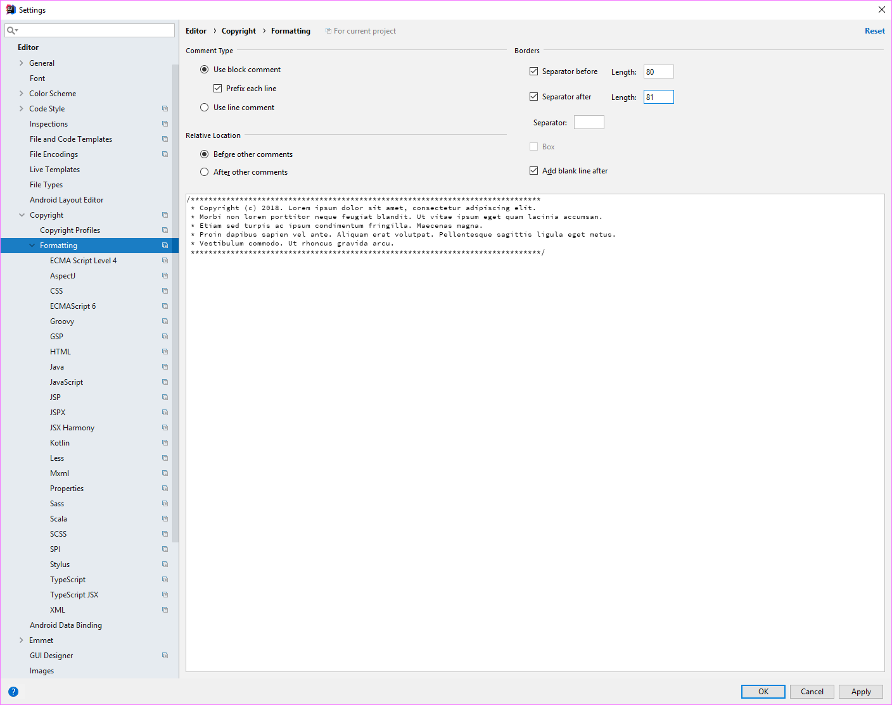

<!---~~~~~~~~~~~~~~~~~~~~~~~~~~~~~~~~~~~~~~~~~~~~~~~~~~~~~~~~~~~~~~~~~~~~~~~~~~~
  ~ Copyright (c) 2020 Contributors to the Eclipse Foundation
  ~
  ~ See the NOTICE file(s) distributed with this work for additional
  ~ information regarding copyright ownership.
  ~
  ~ This program and the accompanying materials are made available under the
  ~ terms of the Eclipse Public License 2.0 which is available at
  ~ http://www.eclipse.org/legal/epl-2.0, or the Apache Software License 2.0
  ~ which is available at https://www.apache.org/licenses/LICENSE-2.0.
  ~
  ~ SPDX-License-Identifier: EPL-2.0 OR Apache-2.0
  ~~~~~~~~~~~~~~~~~~~~~~~~~~~~~~~~~~~~~~~~~~~~~~~~~~~~~~~~~~~~~~~~~~~~~~~~~~~~-->

# IntelliJ Configuration

## Preparation: Install IntelliJ

1. Get a JetBrains Ultimate License. For students: Visit <https://www.jetbrains.com/student>.
2. Install [JetBrains Toolbox](https://www.jetbrains.com/toolbox/): `choco install jetbrainstoolbox` and `choco pin add -n jetbrainstoolbox`, because JetBrains does an auto update
3. Install "IntelliJ IDEA Ultimate" using the JetBrains Toolbox.

## Preparation: Build Winery

Build Winery to have all dependencies fetched by Maven: `mvn install -DskipTests`.

*Note*: You must use Java 17 or above.

## Setup IntelliJ

1. At start of IntelliJ, browse to the root `pom.xml` and open it as project.
2. Enable checkstyle: Follow the shown steps and apply them in IntelliJ
   
   - Install the [IntelliJ Checkstyle Plugin](https://plugins.jetbrains.com/plugin/1065-checkstyle-idea).
     It can be found via plug-in repository (Settings -> Plugins -> Browse repositories)
   - Open the Settings (by pressing <kbd>Ctrl</kbd> + <kbd>Alt</kbd> + <kbd>S</kbd>)
   - Go to Other Settings -> CheckStyle.
   - Click on the green plus and add `checkstyle.xml` from the root of the Winery code repository.
3. Configure the code style
    1. Open the Settings (by pressing <kbd>Ctrl</kbd> + <kbd>Alt</kbd> + <kbd>S</kbd>)
    2. Go to "Editor > Code Style"
    3. Click "Manage..." (right of "Scheme:")
    4. Click "Import Scheme"
    5. Choose "IntelliJ IDEA code style XML"
    6. Navigate to `intellij-idea-code-style.xml`. It is located in `docs/config/IntelliJ IDEA`.
    7. Press "OK"
    8. You will see a message "Winery configuration settings were imported".
    9. Press "OK"
    10. Press "Close"
    11. Press "OK"
4. Setup code headers to be inserted automatically
    1. Open the Settings (by pressing <kbd>Ctrl</kbd> + <kbd>Alt</kbd> + <kbd>S</kbd>)
    2. Go to Editor > Copyright  > Copyright Profiles
    3. Click the green plus
    4. Name "Winery"
    5. Copyright text from [Source Code Headers](../../dev/source-code-headers.md)
    6. Go to Editor > Copyright > Formatting
    7. Adjust copyright formatting settings
       - Change to `Use block comments` with `Prefix each line`
       - Set `Relative Location` to `Before other comments`
       - Increase `Separator before/after Length` to `81`
       - 
    8. Go to Editor > Copyright
    9. Set "Winery" as Default project copyright
    10. Press "OK"
5. Setup Apache Tomcat
    1. Download Tomcat 9 from <https://tomcat.apache.org/download-90.cgi>.
       Choose "zip" (e.g., <http://mirror.synyx.de/apache/tomcat/tomcat-9/v9.0.7/bin/apache-tomcat-9.0.7.zip>).
    2. Extract it, e.g., to `c:\apache`. Result: `C:\apache\apache-tomcat-9.0.7`.
    3. Open the run configurations
       
    4. Select the `Winery Server` configuration and click on `Configure` next to the `Application server` to configure your Tomcat 
6. OPTIONAL: In case you do not want to have the live-update of Angular, you build the WARs of the UI and then deploy as follows:
    - External artifact `.../org.eclipse.winery.frontends/target/tosca-management.war` to `/`
    - External artifact `.../org.eclipse.winery.frontends/target/topologymodeler.war` to `/winery-topologymodeler`
    - External artifact `.../org.eclipse.winery.frontends/target/workflowmodeler.war` to `/winery-workflowmodeler`
7. To run everything select the `Winery` run configuration and click on "Play" (the green rectangle). Afterwards, you can open the UI on <http://localhost:4200> in your browser.
   - To run single run configurations select the corresponding configuration and click the "Play"-button.
       - Select `Winery Server`. Click on "Play".
       - Select `TOSCA Mangement UI`. Click on "Play"
       - Select `Topologymodeler`. Click on "Play".
       - Select `Workflowmodeler`. Click on "Play".
8. After the first run, you can find the default Winery configuration's file in `~/.winery/winery.yml`.
   Here, you can configure Winery, e.g., to use a specific TOSCA Definitions repository by setting the `repositoryRoot` value to a folder that you want to use as winery repository.
   For example: `repositoryRoot: C:\tosca-definitions\tosca-definitions-example-applications` 
9. OPTIONAL: Demonstration: Open winery-repository (AKA tosca-definitions) in IntelliJ  
   This ensures that you can work with the TOSCA files using the IDE.
   1. Go to File -> Open...
   2. Enter `c:\winery-repository`
   3. Click "OK"
   4. At the dialog "Open Project" choose "New Window"
   5. Expand `winery-repository` (on the left side)
   6. Expand `nodetypes`
   7. Expand `http%3A%2F%2Fplain.winery.opentosca.org%2Fnodetypes`
   8. Expand `NodeTypeWithTwoKVProperties`
   9. Double click `NodeType.tosca`
   10. Go to line 14
   11. Type in `<`
   12. See that `<tosca:CapabilityDefinitions` and other `tosca` elements are proposed
   13. No further action required. You can close the window.
10. OPTIONAL: Setup XSD validation for TOSCA files
     1. Open the Settings (by pressing <kbd>Ctrl</kbd> + <kbd>Alt</kbd> + <kbd>S</kbd>)
     2. Go to "Languages & Frameworks"
     3. Select "Schemas and DTDs"
     4. Click on the plus on the right at "External Schemas and DTDs"
     5. Enter `http://docs.oasis-open.org/tosca/ns/2011/12` as URI
     6. In "Project Schemas" search for `TOSCA-v1.0.xsd`.
        It should be located at "org.eclipse.winery.common".  
        In the case of opening `C:\winery-repository` in IntelliJ, you have to select enter `C:\git-repositories\winery\org.eclipse.winery.common\src\main\resources\TOSCA-v1.0.xsd` in the Field "File"
     7. Click "OK".
     8. Go to "Editor"
     9. Select "File Types"
     10. At "Recognized File Types", scroll down to XML
     11. Select "XML"
     12. At "Registered Patterns", click on the Plus
     13. Enter `*.tosca` in the popup.
     14. Click "OK"
     15. Click "OK"

## Further Remarks

* Please let `.editorconfig` override the settings of IntelliJ
* Shortcuts
  - 2x <kbd>Shift</kbd> / <kbd>Ctrl</kbd>+<kbd>Shift</kbd>+<kbd>F</kbd> / <kbd>Ctrl</kbd>+<kbd>F</kbd>: Differrent forms of search
  - <kbd>Ctrl</kbd>+<kbd>Alt</kbd>+<kbd>L</kbd>: Organize imports (fixes checkstyle)
  - <kbd>Ctrl</kbd>+<kbd>X</kbd>: if nothing is marked: cut line (equal to marking whole line and using <kbd>Ctrl</kbd>+<kbd>X</kbd>)
  - <kbd>Ctrl</kbd>+<kbd>Shift</kbd>+<kbd>T</kbd>: Create/jump to the test class
* See [Update Copyright Header](copyright-header.md) for updating old copyright headers
