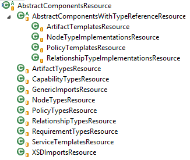

<!---~~~~~~~~~~~~~~~~~~~~~~~~~~~~~~~~~~~~~~~~~~~~~~~~~~~~~~~~~~~~~~~~~~~~~~~~~~~
  ~ Copyright (c) 2020 Contributors to the Eclipse Foundation
  ~
  ~ See the NOTICE file(s) distributed with this work for additional
  ~ information regarding copyright ownership.
  ~
  ~ This program and the accompanying materials are made available under the
  ~ terms of the Eclipse Public License 2.0 which is available at
  ~ http://www.eclipse.org/legal/epl-2.0, or the Apache Software License 2.0
  ~ which is available at https://www.apache.org/licenses/LICENSE-2.0.
  ~
  ~ SPDX-License-Identifier: EPL-2.0 OR Apache-2.0
  ~~~~~~~~~~~~~~~~~~~~~~~~~~~~~~~~~~~~~~~~~~~~~~~~~~~~~~~~~~~~~~~~~~~~~~~~~~~~-->

# REST API

All resources are implemented in classes in the package `org.eclipse.winery.repository.rest.resources`.
We call all elements directly nested in the definitions element "components".
They are implemented using JAX RS using [Jersey](https://eclipse-ee4j.github.io/jersey/).

The full set the API is used by the Management user interface and the Topology Modeler.

## URL Structure

The idea behind the URL structure may shortly describes by `ROOT/<componenttype>s/<double-encoded-namespace>/<double-encoded-id>/<resource-specific-part>`, which makes the structure similar to one of the [file system](repository-layout.md).
Encoding is done following [RFC 3986](https://tools.ietf.org/html/rfc3986#section-2.1). 
An online URL-encoder may be found at: <http://www.albinoresearch.com/misc/urlencode.php>.

For instance, the NodeType "NT1" in the namespace `http://www.example.com/NodeTypes` is found at the URL `nodetypes/http%253A%252F%252Fexample.com%252FNodeTypes/NT1/`.
As the browser decodes the URL, the namespace and the id are double encoded. 
Note the additional encoding of the symbol `%` in comparison to the encoding at the filesystem.
This is due to security decisions to disallow `%2F` in URLs.

The part until `<componenttype>s` is realized by ["AbstractComponentsResource" and its subclasses](#collections-of-components).
The resource specific part is realized by [subclasses of AbstractComponentInstanceResource](#component-instances).

More information on encoding is given at [Encoding](encoding.md).

## Collections of Components

  

The figure above shows the inheritance of AbstractComponentsResource.
It contains an intermediate class `AbstractComponentsWithTypeReferenceResource` which handles a POST with an additional type.
It is used at all components which have a type associated.
These are artifact templates, node type implementations, relationship type implementations and policy templates.

All logic is implemented in `AbstractComponentsResource`.
It handles creation of resources (using POST) and creation of `AbstractComponentInstanceResources`.

## Component Instances

  

The figure above shows the inheritance of `AbstractComponentInstanceResource`.
For each component, a class exists.
Using Intermediate classes, common properties are handled.
These are explained in the following sections.

### AbstractComponentInstanceResourceWithNameDerivedFromAbstractFinal

Several component instances have the attributes `name`, `dervidedFrom`, `abstract`, and `final`.
These are handled in the class `AbstractComponentInstanceResourceWithNameDerivedFromAbstractFinal`.
In this group, type implementations, namely node type implementations and relationship type implementations can be found.

Furthermore, type resources exist.
These are grouped by the `EntityTypeResource`.
Within the context of this class, `TopologyGraphElementEntityTypeResource` is introduced.
This class groups together `NodeTypeResource` and `RelationshipTypeResource`.

### AbstractComponentInstanceWithReferencesResource

This class groups together classes with file references.
Artifact Templates may reference files and a Service Template may reference plans.
The user can copy files manually to the right place in the directory structure of the repository.
By calling the method `synchronizeReferences()`, the referenced stores in the XML are synchronized with the actually existing files. This is done whenever the XML is retrieved from the repository.

#### GenericImportResource

This class is used to handle different import types.
Currently, only CSD is supported. 
The class is `XSDImportResource`.

#### PolicyTemplateResource

This class implements the resource for a policy template.
Since a policy template does not contain any external file references, it is not modeled as child of `AbstractComponentInstanceWithReferencesResource`.
