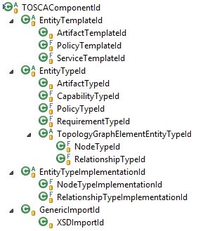

<!---~~~~~~~~~~~~~~~~~~~~~~~~~~~~~~~~~~~~~~~~~~~~~~~~~~~~~~~~~~~~~~~~~~~~~~~~~~~
  ~ Copyright (c) 2020 Contributors to the Eclipse Foundation
  ~
  ~ See the NOTICE file(s) distributed with this work for additional
  ~ information regarding copyright ownership.
  ~
  ~ This program and the accompanying materials are made available under the
  ~ terms of the Eclipse Public License 2.0 which is available at
  ~ http://www.eclipse.org/legal/epl-2.0, or the Apache Software License 2.0
  ~ which is available at https://www.apache.org/licenses/LICENSE-2.0.
  ~
  ~ SPDX-License-Identifier: EPL-2.0 OR Apache-2.0
  ~~~~~~~~~~~~~~~~~~~~~~~~~~~~~~~~~~~~~~~~~~~~~~~~~~~~~~~~~~~~~~~~~~~~~~~~~~~~-->

# Winery's ID System

The general idea behind the storage of Winery is that each entity comes with an id.
The id is either self contained or references a parent id, where the element is nested in.
All Ids inherit from `GenericId`.

  

The child `AdminId` is used for all administrative elements required for internal management.
`DummyParentForGeneratedXSDRef` is required during the export of generated XML Schema Definitions due to the use of Winery's key/value properties.
`DefinitionsChildId` is the parent element for all TOSCA Elements which may be defined directly as child of a "Definitions" element.
All other elements have "TOSCAElementId" as parent.

## AdminId

`NamespacesId` is used as container for a mapping file from namespace prefixes to namespaces. 
`TypesId` is the parent element of all types user can set.
These are not node types etc., but `ConstraintTypes` (for Constraints), `PlanLanguages` (for plans), and `PlanTypes` (for plans).
The inclusion of `PlanLanguages` is due to reuse of the class `AbstractTypesManager` for plan languages.
TOSCA does not restrict these enumerations.
Therefore, Winery manages all known types for itself.

## DefinitionsChildId

This ID class is used for all entities directly nested in a `TDefinitions` element.
They all have a namespace and an id attribute.
This is ensured by `DefinitionsChildId`.

`EntityTemplateId` collects all Entity Templates directly nested in a Definitions element.
As a result, the ids of NodeTemplates or RelationshipTemplates do not inherit from EntityTemplateId.
They are contained in a Service Template and not directly in the Definitions element.
Thus, the only children of `EntityTemplateId` are `ArtifactTemplateId`, `PolicyTemplateId`, and `ServiceTemplateId`.

`EntityTypeId` collects all Entity Types directly nested in a `TDefinitions` element.
These are IDs for ArtifactTypes, CapabilityTypes, PolicyTypes, RequirementTypes, NodeTypes and RelationshipTypes.
Node Types and Relationship Types have the direct parent `TopologyGraphElementTypeId` as these two types form the types of components of the topology graph.

`EntityTypeImplementationId` is the parent id for NodeTypeImplementationId and RelationshipTypeImplementationId and thus subsumes the two possible entities which can be implementations.

`GenericImportId` is an artificial entity.
It is used to be able to store imports of an imported CSAR.
These imports might be XSD definitions, but also WSDL files.
