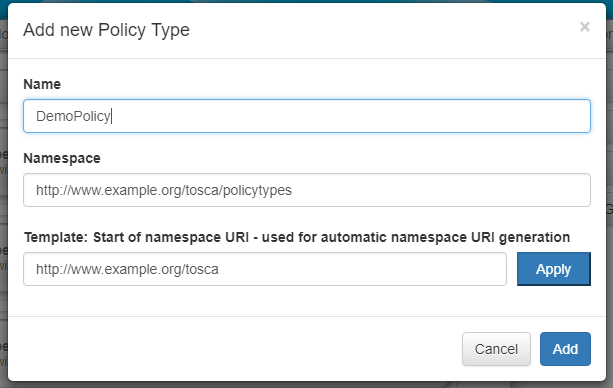
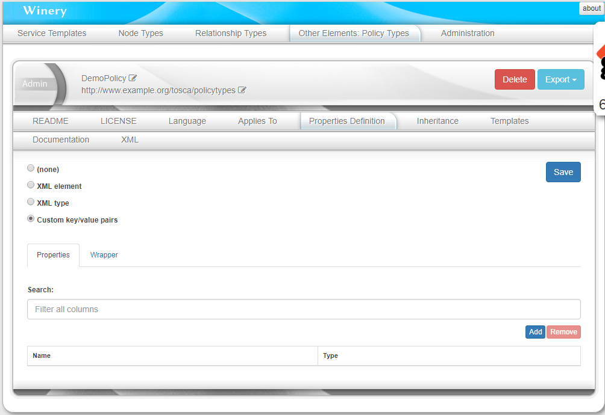
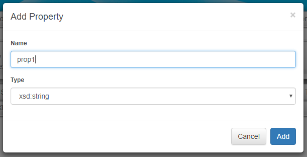
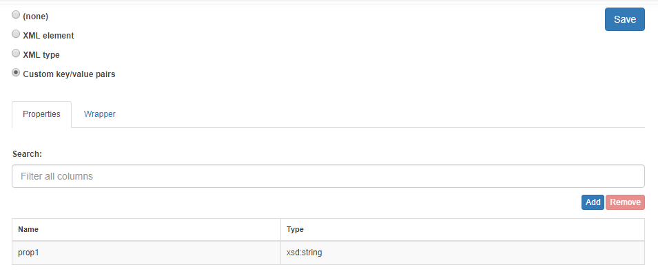
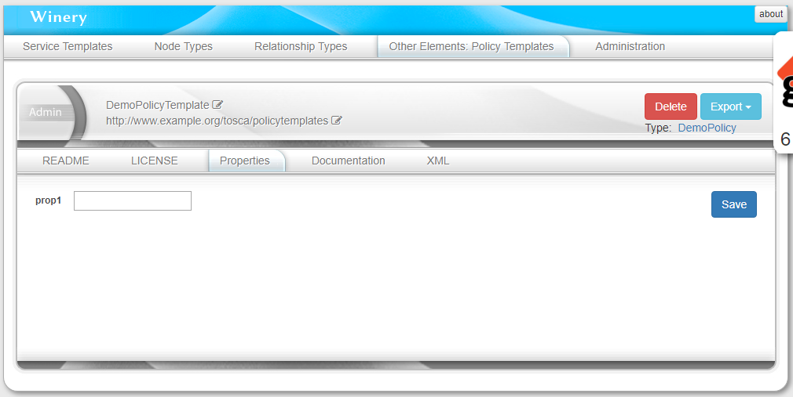

# Winery's property handling by example of policy type + policy template

## Using the 'propertiesDefinitionComponent' in the frontend

In this section we will take a look at how the propertiesDefinition component can be used in the winery application.

The frontend is build using the web framework angular2. An Angular2 application is typically build out of so called components. Each component should be responsible for a specific task, including the UI part as well as handling the data needed to fullfill the specific task. Those components are then plugged into each other or put together to create an application. Therefore it is adviced to build a component such that it can be reused within the application.

The following will explain the use of the propertiesDefinition component by example of its usage in the policy type instance.

To make the frontend part of the winery application as modular, component based and generic as possible, the following architecture was chosen ([see here](https://github.com/eclipse/winery/blob/master/docs/dev/RepositoryUI.md)).
The instance component is responsible for rendering most of the types/templates. As a result of that, the components required for a type/template are being injected into the instance components router outlet. This is true for the policy type as well.

Here is one example on how to use the propertiesDefinition component by example of the policy type (instance component).
 
1. Insert a tab 'Properties Definition' into the sub-header of the instance component for the policy type.
Therefor, open the file [`instance.service.ts`](https://github.com/OpenTOSCA/winery/blob/cdbce161aac69c5a861a9f2be3b7e7d809674186/org.eclipse.winery.repository.ui/src/app/instance/instance.service.ts#L1) and insert a 'Properties Definition' entry into the submenu array for the policy type in the [`getSubMenuByResource()`](https://github.com/OpenTOSCA/winery/blob/cdbce161aac69c5a861a9f2be3b7e7d809674186/org.eclipse.winery.repository.ui/src/app/instance/instance.service.ts#L39) method.

Example(current winery implementation):
```typescript
 case ToscaTypes.PolicyType:
                subMenu = ['README', 'LICENSE', 'Language', 'Applies To', 'Properties Definition', 'Inheritance', 'Templates', 'Documentation', 'XML'];
                break;
```
This will create a clickable entry in the submenu.

2. Next we set up the routing of the policy type such that the 'propertiesDefinition' component is loaded when the corresponding entry in the submenu is clicked.
Navigate to the file [`policyTypeRouter.module.ts`](https://github.com/OpenTOSCA/winery/blob/cdbce161aac69c5a861a9f2be3b7e7d809674186/org.eclipse.winery.repository.ui/src/app/wineryMainModules/policyTypes/policyTypeRouter.module.ts#L1) and add an entry to the 'children' array of the [`policyTypeRoutes`](https://github.com/OpenTOSCA/winery/blob/cdbce161aac69c5a861a9f2be3b7e7d809674186/org.eclipse.winery.repository.ui/src/app/wineryMainModules/policyTypes/policyTypeRouter.module.ts#L33) that will tell the router to load the correct component.

The entry looks like this:
```typescript
{path: 'propertiesdefinition', component: PropertiesDefinitionComponent},
``` 
This is necessary so the router will inject the 'propertiesDefinitionComponent' into the `<router-outlet></router-outlet>` of the instance component when the 'Properties Definition' submenu is clicked.
Further, clicking on the 'Properties Definition' submenu will append '/propertiesdefinition' to the end of the current URL and send a GET request to the URL when the submenu is clicked. The handling of received data as well as the data to be sent is done by the propertiesDefinitionComponent.


## Policy Type creation

### Winery GUI

- click on other elements -> policy types -> add new
- choose a fitting name
- select one of the available namespaces or type in a new namespace
- click the 'Add' button

Screenshot of the create modal


The Winery application creates the policy type, however the policy type does not yet contain any properties. This can be observed in the xml representation of the policy type as well as in the GUI.


### Resulting XML
```xml
<?xml version="1.0" encoding="UTF-8" standalone="yes"?>
<Definitions targetNamespace="http://www.example.org/tosca/policytypes" id="winery-defs-for_policytypes1-DemoPolicy" xmlns="http://docs.oasis-open.org/tosca/ns/2011/12" xmlns:selfservice="http://www.eclipse.org/winery/model/selfservice" xmlns:winery="http://www.opentosca.org/winery/extensions/tosca/2013/02/12" xmlns:testwineryopentoscaorg="http://test.winery.opentosca.org">
    <PolicyType name="DemoPolicy" targetNamespace="http://www.example.org/tosca/policytypes"/>
</Definitions>
```

## Property creation

### Winery GUI

- click on 'Properties Definition' in the sub header and choose the 'custom key/value' radio button.

GUI sceenshot:


- click on the 'Add' button
- again, choose a fitting name
- select a namespace or create a new one 
- click the 'Add' button

GUI Screenshot
 

The application shows the newly created property in the table.

 

click the 'save' to save the property to the policy type.

After adding a property to the policy type the resulting xml looks like this:

```xml
<?xml version="1.0" encoding="UTF-8" standalone="yes"?>
<Definitions targetNamespace="http://www.example.org/tosca/policytypes" id="winery-defs-for_policytypes1-DemoPolicy" xmlns="http://docs.oasis-open.org/tosca/ns/2011/12" xmlns:selfservice="http://www.eclipse.org/winery/model/selfservice" xmlns:winery="http://www.opentosca.org/winery/extensions/tosca/2013/02/12" xmlns:testwineryopentoscaorg="http://test.winery.opentosca.org">
    <PolicyType name="DemoPolicy" targetNamespace="http://www.example.org/tosca/policytypes">
        <winery:PropertiesDefinition elementname="properties" namespace="http://www.example.org/tosca/policytypes/propertiesdefinition/winery">
            <winery:properties>
                <winery:key>prop1</winery:key>
                <winery:type>xsd:string</winery:type>
            </winery:properties>
        </winery:PropertiesDefinition>
    </PolicyType>
</Definitions>
```
### Winery Backend
The request to create a property is received by the [`OnPost()`](https://github.com/OpenTOSCA/winery/blob/0904a5c432364af22b68dc4d6d0769601e68b346/org.eclipse.winery.repository.rest/src/main/java/org/eclipse/winery/repository/rest/resources/entitytypes/properties/PropertiesDefinitionResource.java#L108) method in the [`PropertiesDefinitionResource.java`](https://github.com/OpenTOSCA/winery/blob/ustutt/org.eclipse.winery.repository.rest/src/main/java/org/eclipse/winery/repository/rest/resources/entitytypes/properties/PropertiesDefinitionResource.java) class.
The following code fragment (starting at line 131) in the [`OnPost()`](https://github.com/OpenTOSCA/winery/blob/0904a5c432364af22b68dc4d6d0769601e68b346/org.eclipse.winery.repository.rest/src/main/java/org/eclipse/winery/repository/rest/resources/entitytypes/properties/PropertiesDefinitionResource.java#L108) is responsible for handling requests to create a custom key/value property:
```java
else if (data.selectedValue == PropertiesDefinitionEnum.Custom) {
            TEntityType et = this.parentRes.getEntityType();

            // clear current properties definition
            et.setPropertiesDefinition(null);

            // create winery properties definition and persist it
            ModelUtilities.replaceWinerysPropertiesDefinition(et, data.winerysPropertiesDefinition);
            String namespace = data.winerysPropertiesDefinition.getNamespace();
            NamespaceManager namespaceManager = RepositoryFactory.getRepository().getNamespaceManager();
            if (!namespaceManager.hasPrefix(namespace)) {
                namespaceManager.addNamespace(namespace);
            }
            return RestUtils.persist(this.parentRes);
        }
``` 


# Policy Template creation

### Winery GUI

- other elements -> policy templates -> add new
- fill out the required fields
    - choose the newly created policy type (DemoPolicy) as type for the template
- click the 'Add' button

GUI screenshot:


The created policy template has a property with the same key (prop1) as the policy type. This can be observed in the 'xml' tab as well as in the 'properties' tab.

XML:
```xml
<?xml version="1.0" encoding="UTF-8" standalone="yes"?>
<Definitions targetNamespace="http://www.example.org/tosca/policytemplates" id="winery-defs-for_policytemplates1-DemoPolicyTemplate" xmlns="http://docs.oasis-open.org/tosca/ns/2011/12" xmlns:selfservice="http://www.eclipse.org/winery/model/selfservice" xmlns:winery="http://www.opentosca.org/winery/extensions/tosca/2013/02/12" xmlns:testwineryopentoscaorg="http://test.winery.opentosca.org">
    <PolicyTemplate name="DemoPolicyTemplate" type="policytypes1:DemoPolicy" id="DemoPolicyTemplate" xmlns:policytypes1="http://www.example.org/tosca/policytypes">
        <Properties>
            <properties xmlns="http://www.example.org/tosca/policytypes/propertiesdefinition/winery">
                <prop1/>
            </properties>
        </Properties>
    </PolicyTemplate>
</Definitions>
```

Poperties tab:


## Assigning a value
### Winery GUI
Enter the value that should be assigned to the property in the input filed and click on save.

Screenshot:


XML:
```xml
<?xml version="1.0" encoding="UTF-8" standalone="yes"?>
<Definitions targetNamespace="http://www.example.org/tosca/policytemplates" id="winery-defs-for_policytemplates1-DemoPolicyTemplate" xmlns="http://docs.oasis-open.org/tosca/ns/2011/12" xmlns:selfservice="http://www.eclipse.org/winery/model/selfservice" xmlns:winery="http://www.opentosca.org/winery/extensions/tosca/2013/02/12" xmlns:testwineryopentoscaorg="http://test.winery.opentosca.org">
    <PolicyTemplate name="DemoPolicyTemplate" type="policytypes1:DemoPolicy" id="DemoPolicyTemplate" xmlns:policytypes1="http://www.example.org/tosca/policytypes">
        <Properties>
            <properties xmlns="http://www.example.org/tosca/policytypes/propertiesdefinition/winery">
                <prop1>val1</prop1>
            </properties>
        </Properties>
    </PolicyTemplate>
</Definitions>
```

### Winery Backend
The request to add a value to a template property gets handled by the [`setProperties()`](https://github.com/OpenTOSCA/winery/blob/0904a5c432364af22b68dc4d6d0769601e68b346/org.eclipse.winery.repository.rest/src/main/java/org/eclipse/winery/repository/rest/resources/entitytemplates/PropertiesResource.java#L59) method in the [`PropertiesResource.java`](https://github.com/OpenTOSCA/winery/blob/0904a5c432364af22b68dc4d6d0769601e68b346/org.eclipse.winery.repository.rest/src/main/java/org/eclipse/winery/repository/rest/resources/entitytemplates/PropertiesResource.java#L59) class.


```java
public Response setProperties(Map<String, String> properties) {
        this.template.getProperties().setKVProperties(properties);
        return RestUtils.persist(this.res);
    }
```

## License

Copyright (c) 2018 Contributors to the Eclipse Foundation

See the NOTICE file(s) distributed with this work for additional
information regarding copyright ownership.

This program and the accompanying materials are made available under the
terms of the Eclipse Public License 2.0 which is available at
http://www.eclipse.org/legal/epl-2.0, or the Apache Software License 2.0
which is available at https://www.apache.org/licenses/LICENSE-2.0.

SPDX-License-Identifier: EPL-2.0 OR Apache-2.0
