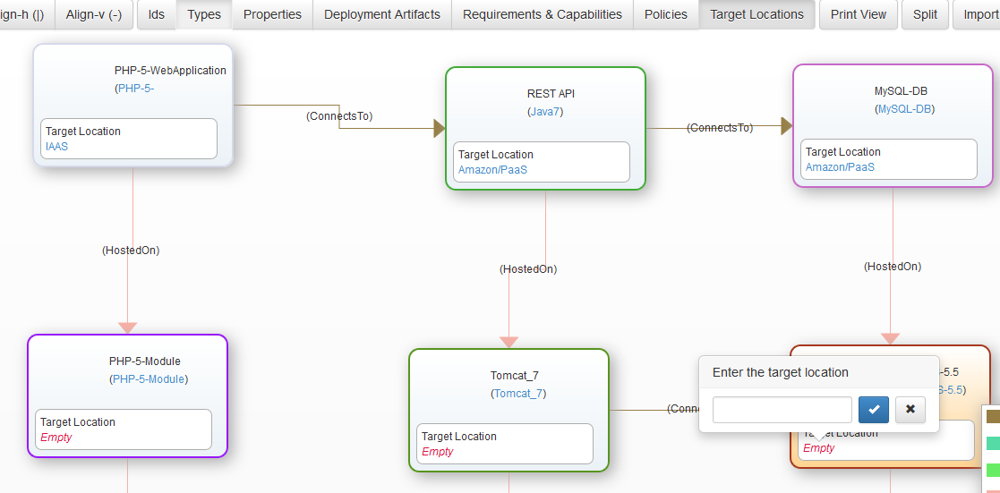

# Splitting Functionality

In the topologymodeler target labels can be shown/hidden by "Target Locations" - The Target Location assigned
 to a Node Template determines the service templates serving as cloud provider repositories, which should be searched
 for a suitable host. The namespace of all cloud provider repositories must start with "http://www.opentosca.org/providers/".
 To distinguish between different repositories the namespace must end with the target label, e.g.
  "../IAAS" or "../Amazon/PaaS". The target labels are not case sensitive.

A prerequisite for a splitting is the assignment of requirements and capabilities to all Node Templates in the
Topology Template, which should be split, and the Node Templates in the repositories.
The latter just have requirements assigned because they form the lowest level of the topology.
The naming convention for the mapping of Reqs and Caps are:

	- Requirement: ReqCanHostxyz
	- Capability:  CapCanHostxyz

By clicking the "Split" button first the topology is split according to the assigned labels (nodes with
hostedOn-predecessors with different labels are duplicated) and second the host nodes from the provider repositories
are matched.
For this, lower level nodes can be removed and replaced.

The split as well as the matched topology are persistently stored with an attached "-split" and "-matched" in
the Service Template Id.

