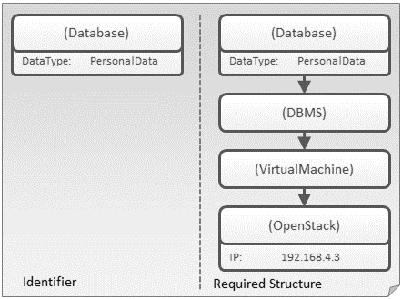
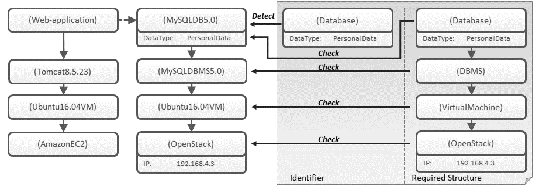
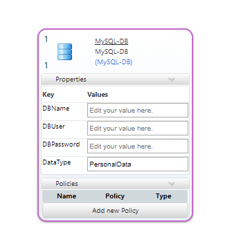
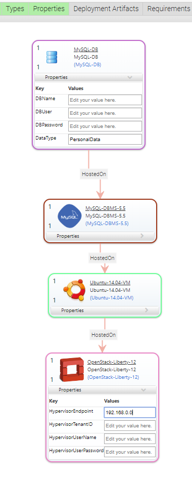
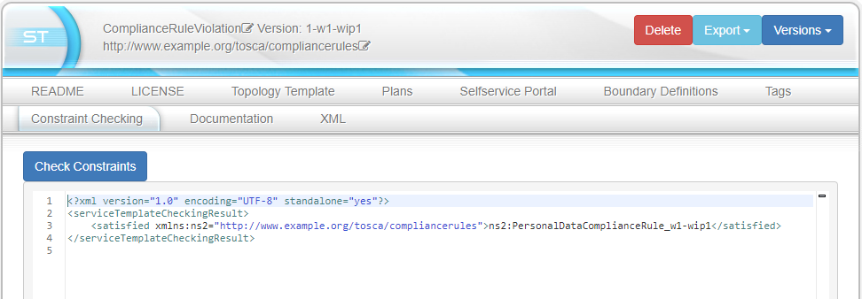

<!---~~~~~~~~~~~~~~~~~~~~~~~~~~~~~~~~~~~~~~~~~~~~~~~~~~~~~~~~~~~~~~~~~~~~~~~~~~~
  ~ Copyright (c) 2020 Contributors to the Eclipse Foundation
  ~
  ~ See the NOTICE file(s) distributed with this work for additional
  ~ information regarding copyright ownership.
  ~
  ~ This program and the accompanying materials are made available under the
  ~ terms of the Eclipse Public License 2.0 which is available at
  ~ http://www.eclipse.org/legal/epl-2.0, or the Apache Software License 2.0
  ~ which is available at https://www.apache.org/licenses/LICENSE-2.0.
  ~
  ~ SPDX-License-Identifier: EPL-2.0 OR Apache-2.0
  ~~~~~~~~~~~~~~~~~~~~~~~~~~~~~~~~~~~~~~~~~~~~~~~~~~~~~~~~~~~~~~~~~~~~~~~~~~~~-->

# Topology Compliance Checking  

The Topology Compliance Checking of Winery enables to describe restrictions, constraints, and requirements for Topology Templates in form of reusable topology-based Compliance Rules.
Furthermore, the Compliance Checker of Winery can be used to ensure that a given Topology Template is compliant to the current set of Compliance Rules.

## Structure of a Compliance Rule

A Compliance Rule itself consists of two Topology Templates called
Identifier and Required Structure.
The Identifier is used to detect areas in a Topology Template that are subject to the rule while the
Required Structure is used to verify if the rule is satisfied. It is important to note that a Compliance Rule is only valid if there is exactly one matching mapping from the Identifier to the Required Structure.
A Topology Element 𝑒1 can be matched to a Topology Element 𝑒2 if the type of 𝑒2 is of the same type or supertype of the type of 𝑒1. Furthermore, all attributes of 𝑒1 must also be present in 𝑒2 with equivalent 𝐾𝑒𝑦 and 𝑉𝑎𝑙𝑢𝑒.

An example of a valid Compliance Rule is shown here:

The Identifier consists of a single Node Template with a property "DataType: PersonalData". As the Required Structure contains a Node Template of the same type and with a property with equivalent key and value it exists a matching mapping.
Hence, the compliance rule is valid.

## Concept of Compliance Checking

The detection of relevant compliance areas in Topology Models is based on the detection of subgraph isomorphisms which also takes the types and attributes of Topology Elements forming the Topology Model into account.
An example of a Compliance Rule that is **detected** and **satisfied** for a Topology Template is shown here:

**Detected** means: A Compliance Rule is detected if there is at least on matching mapping from the Identifier to the Topology Model.

**Satisfied** means: A Compliance Rule is satisfied if each area that has been found by the detector also satisfies the Required Structure. Otherwise a rule is unsatisfied.

## Tutorial

In the following, a simple example is given describing how to use Topology Compliance Checking.
We will describe how to create your first topology-based Compliance Rule and how to check the compliance of Topology Templates based on existing Compliance Rules.

Note: You should have a look at the [Winery User Guide](http://eclipse.github.io/winery) before reading this tutorial to get all the basic knowledge about Winery.

### Step 1: Start Winery

If you need help getting Winery up and running have a look at the [Quickstart Guide](http://eclipse.github.io/winery)

### Step 2: Create a compliance rule

First, we need to create a Compliance Rule.
Select the tab  "Other Elements" => "Compliance Rules" to get an overview of the existing Compliance Rules in the repository.
Click on "Add new" to create a new Compliance Rule. A modal to add a new Compliance Rule appears:

1. Enter a name for your rule e.g., "PersonalDataComplianceRule"
2. Choose a namespace for the Compliance Rule.  
3. Click "Add"

**Note**: The namespace is used to identify all Topology Templates that are subject to the rule.
This means each Compliance Rule defined for a certain namespace automatically applies to all Topology Templates defined in that namespace.

#### Step.2.1: Model Identifier and Required Structure

After the previous steps a Compliance Rule with empty Identifier and Required Structure is created.
Subsequent, the Topology Modeler of Winery can be used to model the Identifier and Required Structure of the Compliance Rule:  

1. Choose Tab "Identifier" or "Required Structure"
2. Click "Open Editor"
3. Model "Identifier" or "Required Structure"

An exemplary Compliance Rule that is concerned with the storage of personal user data may look like this:

Identifier             |  Required Structure
:-------------------------:|:-------------------------:
  |  

The motivation for this Compliance Rule is to ensure that all MySQL databases that store personal data are hosted on a specific OpenStack Component with the HypervisorEndpoint: "192.168.4.3".

### Step 3: Check Compliance of a Topology Template

After creating our first Compliance Rule we can check if a Topology Template with the same namespace satisfies this rule.
Therefor, we can either use an existing Service Template or create a new Service Template.
Note that it is important to ensure that the Compliance Rule is detected in your Topology Template.
Compliance Rules that are not detected in a Topology Template are satisfied.

1. Click on the "Service Templates" tab
2. Select a Service Template whose Topology Template needs to be checked for compliance
3. Click on the "Constraint Checking" tab
4. Click on the button "Check Constraints"
5. The results will be shown as XML

An example of a Topology Template that does not satisfy the Compliance Rule defined in Step 2.1 is shown below:

Topology Template             |  Result
:-------------------------:|:-------------------------:
 | 

The left side shows the modeled Topology Template.
The specified property HypervisorEndpoint: "192.168.0.0" of the OpenStack component violates the constraints specified by the Compliance Rule.
The violation is detected by the Compliance Checker and returned in the result.  

After updating the property HypervisorEndpoint to "192.168.4.3" the Topology Template does satisfy the compliance rule defined in Step 2.1 as shown below:

Topology Template             |  Result
:-------------------------:|:-------------------------:
  |  
