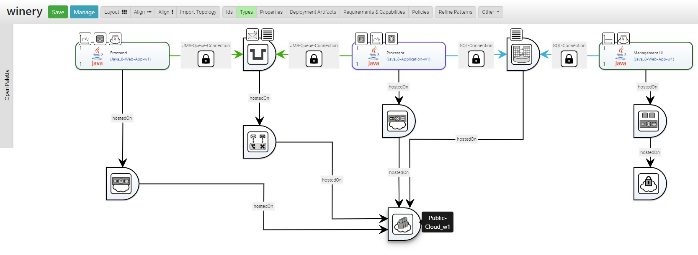

<!---~~~~~~~~~~~~~~~~~~~~~~~~~~~~~~~~~~~~~~~~~~~~~~~~~~~~~~~~~~~~~~~~~~~~~~~~~~~
  ~ Copyright (c) 2020 Contributors to the Eclipse Foundation
  ~
  ~ See the NOTICE file(s) distributed with this work for additional
  ~ information regarding copyright ownership.
  ~
  ~ This program and the accompanying materials are made available under the
  ~ terms of the Eclipse Public License 2.0 which is available at
  ~ http://www.eclipse.org/legal/epl-2.0, or the Apache Software License 2.0
  ~ which is available at https://www.apache.org/licenses/LICENSE-2.0.
  ~
  ~ SPDX-License-Identifier: EPL-2.0 OR Apache-2.0
  ~~~~~~~~~~~~~~~~~~~~~~~~~~~~~~~~~~~~~~~~~~~~~~~~~~~~~~~~~~~~~~~~~~~~~~~~~~~~-->

# Pattern-based Deployment and Configuration Models (PbDCMs)

This is a guide to the Pattern-bsed Deployment and Configuration Model (PbDCM) approach that is presented in the UCC 2019 paper `Pattern-based Deployment Models Revisited: Automated Pattern-driven Deployment Configuration`.

**IMPORTANT NOTE**: To use this feature, you must have the `Pattern Refinement` feature enabled which is available in the `Configuration` tab underneath the `Administration`.

## Modeling of PbDCMs

As described in the paper, a PbDCM can be modeled in TOSCA in a Topology Template of a Service Template.
However, instead of containing concrete only _Components_, a PbDCM contains also _Component Patterns_ and _Behavor Pattern_.
A _Component Pattern_ is hereby represented as a Node Template that is defined in a Namespace that has been tagged as a "Pattern Namespace". 

Videos on how to model and refine a PbDCM are available on [YouTube](https://www.youtube.com/playlist?list=PLLP47UpoeRSDfr9s0ZYV20mgClcfvh15q).

An example PbDCM is shown here: 

### Pattern Types

To create a _Pattern Type_ in TOSCA, Namespaces that are tagged to contain only patterns are used.
Therefore, so-called "Pattern Namespaces" are identified by the `patternCollection` property set to `true`.

A Namespace can be transformed to a "Pattern Namespace" in the `Administration` area of Winery.
Underneath the `Namesapces` tab, all settings for Namespaces can be edited.
Hence, to create a "Pattern Namespace", or to identify an existing Namespace as a "Pattern Namespace", set the `Is a pattern collection` flag of the corresponding Namespace.

#### Component Pattern Types

To create a _Component Pattern Type_, create a Node Type inside a "Pattern Namespace".

#### Behavior Pattern Types

To create a _Behavior Pattern Type_, create a Policy Type inside a "Pattern Namespace".

## Definition and Handling of Component and Behavior Pattern Refinement Models (CBPRMs)

To enable the automated refinement of PbDCMs, CBPRMs defining at least a _Detector_ and _Refinement Structure_ must be crated.
While the _Detector_ must be mappable to a subgraph of a PbDCM according to the _Compatibility Rule_, the _Refinement Structure_ can contain any kind of Topology Template.

To create, edit, and manage a CBPRM, you need to go to <localhost:4200/#/patternrefinementmodels> or use `Other Elements` and click on `Pattern Refinement Models`.

## Refinement of PbDCMs to Executable Deployment Models

After a PbDCM has been created it can be refined in the Topology Modeler by clicking the `Refine Patterns` button and then `Start Refinement`:

