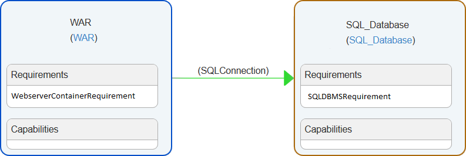
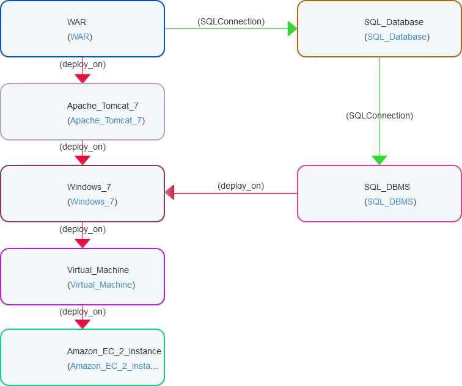
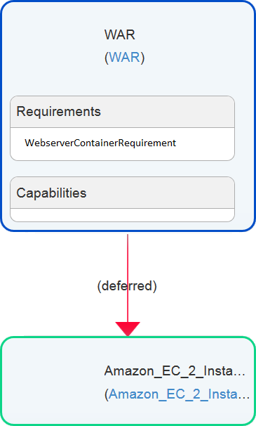
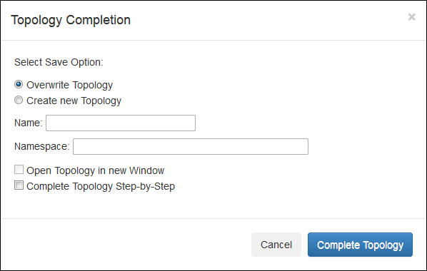

<!---~~~~~~~~~~~~~~~~~~~~~~~~~~~~~~~~~~~~~~~~~~~~~~~~~~~~~~~~~~~~~~~~~~~~~~~~~~~
  ~ Copyright (c) 2020 Contributors to the Eclipse Foundation
  ~
  ~ See the NOTICE file(s) distributed with this work for additional
  ~ information regarding copyright ownership.
  ~
  ~ This program and the accompanying materials are made available under the
  ~ terms of the Eclipse Public License 2.0 which is available at
  ~ http://www.eclipse.org/legal/epl-2.0, or the Apache Software License 2.0
  ~ which is available at https://www.apache.org/licenses/LICENSE-2.0.
  ~
  ~ SPDX-License-Identifier: EPL-2.0 OR Apache-2.0
  ~~~~~~~~~~~~~~~~~~~~~~~~~~~~~~~~~~~~~~~~~~~~~~~~~~~~~~~~~~~~~~~~~~~~~~~~~~~~-->


# TOSCA Topology Completion

The TOSCA Topology Completion of Winery enables the user to model incomplete TOSCA Topology Templates and complete them automatically.

In the following we will describe how such incomplete topologies can be modeled and how the Topology Completion can be invoked.

## Why Topology Completion?

By using the Topology Completion add-on of Winery you are able to minimize your effort when modeling TOSCA topologies. 
In most TOSCA run time environments it is necessary to model a complete topology containing all necessary details to provision an application.
This leads to high costs in the modeling process. Furthermore a lot of know-how is necessary when completing a topology. The modeler has to know about the
components he can insert and their connections. In case this know-how is not granted, the Topology Completion can be very helpful.

The Topology Completion can also be used by inexperienced users who haven't modeled any TOSCA topologies yet.
The step-by-step function of the completion allows these users to comprehend the completion and to learn how a TOSCA Topology Template is modeled.

## Modeling incomplete TOSCA Topology Templates


Figure 1: Example of an incomplete Topology using Requirements

To be able to complete a topology you have to model an incomplete topology first, providing a base for the Topology Completion.
There are several ways to model incomplete topologies that will be described in the following.

## Modeling incomplete TOSCA Topology Templates using TOSCA Requirements

TOSCA Requirements make it possible to define restrictions for the topology completion. By adding TOSCA Requirements to Node Templates
you can determine which elements may or may not be added to the topology. E.g. by adding the Requirement "SQLDatabaseRequirement" you can predetermine
that a "SQLDatabase" Node Template will be added to the topology. Note that in this case a Node Type with a suitable CapabilityDefinition (e.g. SQLDatabaseCapability) has to exist in the Winery Repository to fulfill the Requirement.

The example topology in figure 1 displays the usage of Requirements:


Figure 2: Possible Completion Result

For each Requirement, the Topology Completion will insert Node Templates containing suitable Capabilities. Note that the inserted Node Templates can be attached with further Requirements that will also be fulfilled by the Topology Completion.

A possible completed topology for the example above is displayed in figure 2.

## Modeling incomplete TOSCA Topology Templates using Deferred-Relationship Templates and TOSCA Requirements

In case you want to model part of the infrastructure by yourself (e.g. the Cloud Provider) the usage of Requirements isn't enough.
We need a means to predefine part of a complete topology that isn't directly connected to the application components (which contain the TOSCA Requirements).
To achieve this we introduce a new Relationship Template "deferred", which you will have to create in the Repository as follows:

```xml
<source lang="xml">
   <tosca:RelationshipType name="deferred" targetNamespace=""/>
</source>
```


Figure 3: Incomplete Topologies using Deferred-Relationship Templates

After creating the Relationship Type in the repository you can use it to connect to your modeled infrastructure components.
Figure 3 displays an example for the usage of "deferred"-Relationship Templates. The modeled Amazon Instance will be considered by the Topology Completion.

## Invoking the TOSCA Topology Completion

To invoke the Topology Completion open an incomplete topology in the topology modeler and select "Complete Topology".
In the appearing dialog fill in the save options for the completed topology and if the Topology Completion shall be processed step-by-step.
In case the step-by-step approach is selected, the topology completion algorithm will pause in every step giving feedback about the Node and Relationship Templates to be inserted.
Figure 4 displays the completion dialog:


Figure 4: Completion Dialog

After the form has been completed you can start the completion by selecting "Complete Topology" in the dialog.
After the completion the completed topology will be displayed in the topology modeler or in a new browser window dependent on the selected save options.
